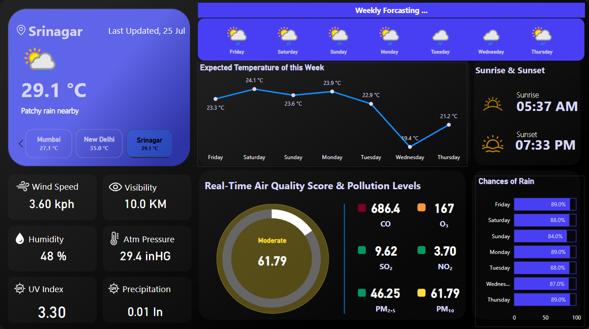

# Live Weather Report (Power-BI)
<br>
## OBJECTIVE:
This project demonstrates how to create a real-time, API-powered weather dashboard using Power BI, integrating key weather parameters like temperature, wind, Vidibility, UV Index, humidity, and Air Quality Index (AQI) from multiple cities (easily scalable). It’s built for students, analysts, and developers who want to explore real-world data integration and visualization using modern tools like Power BI.

---

## Tools & Technologies Used

- **Power BI Desktop**
- **WeatherAPI.com** (Free/paid API)
- **Power Query**
- **DAX** (Data Analysis Expressions)
- **Glassmorphism UI Design**
- **GitHub** (Version Control & Deployment)

---

## Prerequisites

To run or customize this dashboard, you’ll need:
- ✅ Power BI Desktop installed
- ✅ A free account on [https://weatherapi.com](https://weatherapi.com)
- ✅ Your **WeatherAPI key**
- ✅ Basic-intermediate knowledge of Power BI (importing data, using visuals, filters)

---

## 🚀 Key Features

| Feature | Description |
|--------|-------------|
| 🌡️ Real-Time Weather | Displays live temperature, humidity, Visibility, pressure & weather type |
| 🌬️ Wind & Humidity | Insights into current wind speed and moisture levels |
| 📈 Forecast Trends | Line and card visuals showing upcoming weather behavior (Temperature, Raining etc) |
| 🌫️ AQI Metrics | Color-coded air quality indicators: PM10, PM2.5, CO, NO2, SO2, O3, etc. |
| 📍 City Selection | Interactive slicers for city-wise livw weather data insights |
| ⚙️ API Integration | Dynamic JSON extraction from WeatherAPI using Power Query (M Query) |
| 🎨 UI/UX | Clean, modern look. |
| 📊 Dynamic DAX | AQI-based health suggestions, color coding, and labels using modular DAX logic |

---

## Key Insights Delivered

- 🔵 **Temperature trends** by city help understand climate variation.
- 🟢 **Air Quality Index (AQI)** flags environmental health risks.
- 🟡 **Wind & pressure variations** assist in forecasting patterns.
- 🟣 **Custom user filters** allow dynamic exploration across multiple cities.
- 🟠 **Health suggestions** linked to AQI levels for public awareness.
<br>
---

## How It Works (Behind the Scenes)

1 **API FETCH**
  For Example:
https://api.weatherapi.com/v1/current.json?key=YOUR_API_KEY&q=Srinagar

2 **Power BI Connection**
- Use Get Data > Web

- Transform & flatten JSON using Power Query

3 **DAX and Charts To Get Extract Insights and Present**

4. **Air Quality Logic in DAX**  
Reusable patterns for AQI color, status-health suggestion:

```
AQI Status =
VAR AQI = ROUND(SELECTEDVALUE('Current'[pm2_5]), 0)
RETURN SWITCH(
  TRUE(),
  AQI <= 50, "Good",
  AQI <= 100, "Moderate",
  AQI <= 150, "Unhealthy for Sensitive",
  AQI <= 200, "Unhealthy",
  AQI <= 300, "Very Unhealthy",
  "Hazardous"
)
```

### **Why I did this Project?**
- End-to-end real-time data project
- No external coding needed
- Fully customizable Power BI file
- **Boosts your skills in API integration, DAX, and data storytelling**

## **Dashboard Preview**


